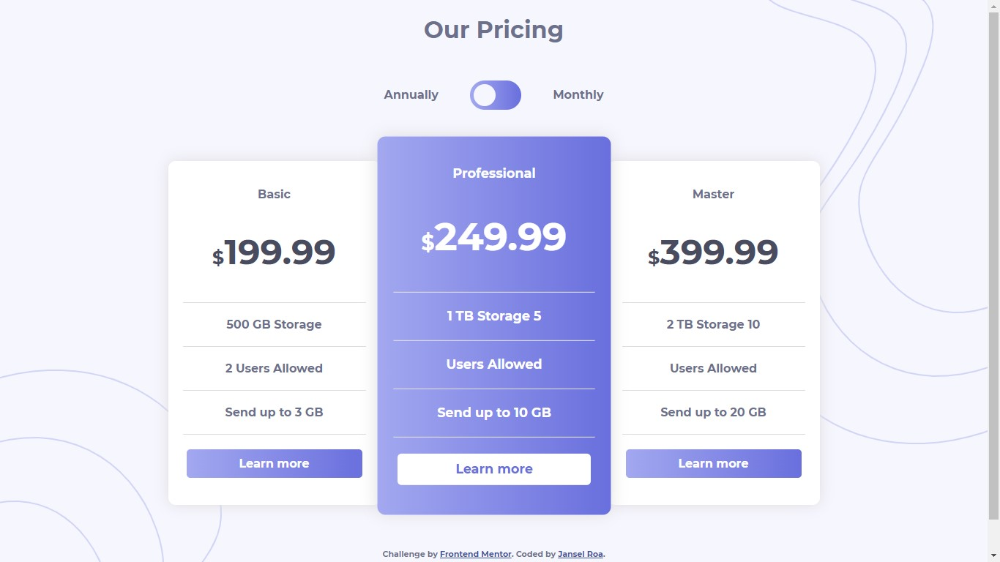

<h2> Pricing component with toggle<h2>
<p>Landing page
Responsive and dynamic build with webpack, babel, and Sass. Frontend mentor <a href="https://www.frontendmentor.io/challenges/pricing-component-with-toggle-8vPwRMIC">challenge</a></p>

## preview



<h3><a href="https://janselroa.github.io/pricing-component/">live preview</a></h3>

## Usage

Download

```cmd
git clone https://github.com/janselroa/pricing-component.git
```

```cmd
yarn install
```

```cmd
yarn webpack serve
```

open <a href="http://localhost:3000">localhost:3000</a>

### npm

```cmd
npm install
```

```cmd
npx webpack serve
```
